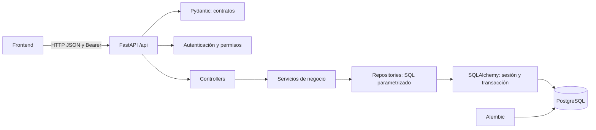
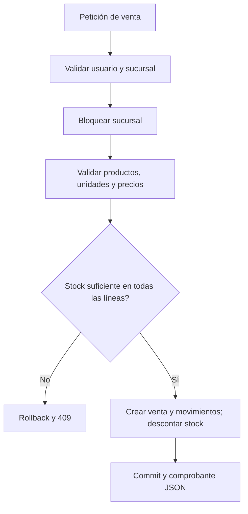
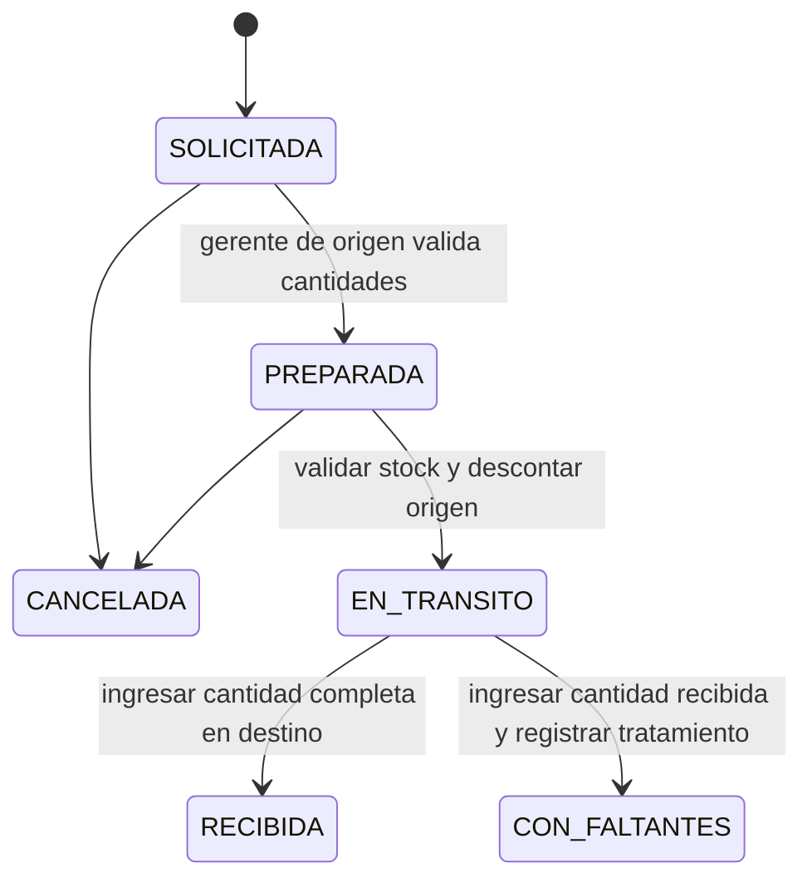

# Decisiones del backend

## Organización acordada

La estructura solicitada para el proyecto es:

| Carpeta | Responsabilidad |
|---|---|
| `conection` | Conexión con la base de datos. |
| `controllers` | Coordinar las llamadas a los servicios. |
| `middlewares` | Interceptar las peticiones. |
| `repositories` | Consultas y persistencia en la base de datos. |
| `service` | Lógica de negocio. |
| `dtos` | Estructura y validación de los paquetes de datos. |
| `routes` | Definición de routers y rutas. |
| `exceptions` | Excepciones personalizadas según el caso. |
| `models` | Entidades, tablas, relaciones y archivo de inserciones iniciales. |

Los archivos están directamente en cada capa, sin subcarpetas por módulo. `docs/historias/HU01_registro_producto.md` describe el flujo implementado.

## Arquitectura

Se conserva el stack del proyecto. FastAPI publica OpenAPI automáticamente; Pydantic valida cantidades y descuentos. PostgreSQL mantiene claves foráneas, precisión decimal y bloqueos de filas. En los módulos de la API, el controller coordina el service, que aplica las reglas de negocio; el repository escribe SQL explícito parametrizado y lo ejecuta mediante la sesión de SQLAlchemy. Los modelos conservan la definición de las tablas. El middleware verifica la identidad de la petición y las exceptions representan los errores de cada caso.

## Coherencia entre sucursales

Todas las sucursales consultan una misma base transaccional; después del commit una nueva consulta ve los cambios. No se implementan bases independientes ni modo sin conexión. No hay push por WebSocket: el frontend debe refrescar o consultar periódicamente la API.

Las escrituras de inventario bloquean primero las filas de las sucursales en orden de ID. Esto protege incluso la creación inicial de existencias, cuando aún no hay una fila de inventario que bloquear. El costo es serializar las escrituras de una sucursal; es una elección deliberada para el alcance de la prueba. Los documentos también se bloquean al cambiar de estado para impedir dobles confirmaciones.

Cada petición usa una transacción; una excepción revierte cabecera, detalles, stock y movimientos. Los costos usan Decimal. El costo promedio de un ingreso es `(stock anterior × costo anterior + ingreso × costo ingreso) / nuevo stock`.

## Flujos

## Seguridad y trazabilidad

JWT firmado con HS256 y expiración; roles y estado del usuario se consultan en cada petición. Las contraseñas se almacenan con bcrypt y se rechazan entradas de más de 72 bytes en vez de truncarlas. CORS utiliza una lista explícita configurable. Las respuestas de error no exponen SQL ni trazas.

Los catálogos referenciados no se eliminan; los documentos confirmados carecen de rutas de borrado. Los movimientos registran usuario, tipo, motivo, cantidad, fecha, costo y referencia. La API de existencias no permite sobrescribir stock o costo directamente.

## Límites de esta entrega

El frontend aún debe conectarse a estas rutas. No se implementan pagos, facturación fiscal, trabajo sin conexión, notificaciones por correo, recuperación de contraseña ni devoluciones comerciales con comprobante propio. Los ajustes manuales permiten registrar entradas y salidas justificadas. Las compras se reciben completas; las transferencias permiten recepción parcial final. El registro del tratamiento de faltantes no ejecuta automáticamente una reclamación externa.
